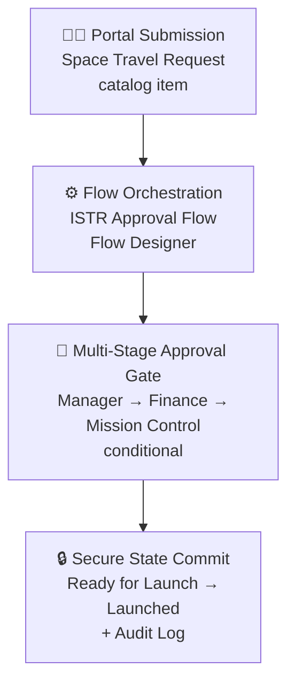
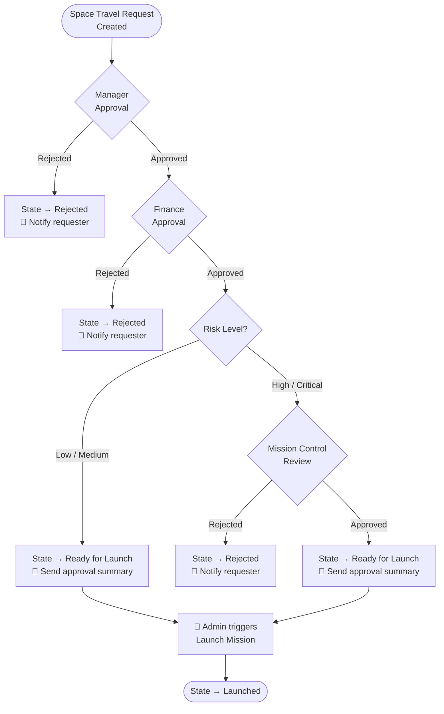

# 🚀 ISTR — Intergalactic Space Travel Request System

**A ServiceNow scoped application that turns interplanetary mission approvals into a fast, transparent, fully-audited workflow.**

*Requester submits → Manager approves → Finance validates budget → Mission Control reviews risk → Admin launches. Zero email chains. Full audit trail.*

---

## 🌌 Why ISTR Exists

Approving a routine interplanetary mission shouldn't require the same chaotic email thread as approving a walk to the vending machine. ISTR replaces manual, disjointed approval chasing with one governed, automated system of record — built entirely on ServiceNow's low-code platform.

> **The problem, in one line:** every stakeholder — Requester, Manager, Finance, Mission Control, Admin — was blocked by the same root cause: no connected, automated system of record.

---

## ✨ Core Features

| Feature | Description |
|---|---|
| 🛰️ **Dynamic Mission Request Form** | Conditional fields — e.g. a Diplomatic Officer is only required for Alien Negotiation missions |
| 🔐 **Role-Based Access Control** | Four scoped roles (`space.requester`, `space.approver`, `space.finance`, `space.admin`) enforced via ACLs |
| 🔁 **Automated Multi-Stage Approval** | One Flow Designer flow orchestrates Manager → Finance → (conditional) Mission Control |
| ⚠️ **Risk-Based Routing** | Only High/Critical risk missions escalate to Mission Control — low-risk requests move fast |
| ⏱️ **SLA Tracking & Notifications** | Timers and automated emails fire at every approval stage |
| 🧾 **Full Audit Trail** | Every state change, approval, and rejection is timestamped and logged |
| 🚀 **Admin-Gated Launch Action** | The "Launch Mission" UI Action is visible only when a request reaches `Ready for Launch` |

---

## 🏗️ Architecture

## 🔄 Approval Flow Logic

---

## 🧰 Tech Stack

| Layer | Technology |
|---|---|
| **Frontend** | ServiceNow Service Catalog (Now Experience) |
| **Automation** | Flow Designer / Workflow Studio — `ISTR Approval Flow` |
| **Data Layer** | Scoped app table `x_2065326_interg_0_space_travel_request` |
| **Security** | Custom scoped roles + Groups (Explorers, Finance, Mission Control) + ACLs |
| **Notifications** | Flow Designer Send Email actions |
| **Deployment** | Update Sets |

---

## 👥 Roles & Permissions

| Role | Group | Can Do |
|---|---|---|
| `space.requester` | Explorers | Submit requests, view own records |
| `space.approver` | Mission Control | Approve/reject, add safety notes |
| `space.finance` | Finance | Edit cost, approve/reject budget |
| `space.admin` | Mission Control | Full access, launch missions, override states |

---

## 📊 Data Model

**Table:** `x_2065326_interg_0_space_travel_request`

| Field | Type | Notes |
|---|---|---|
| `destination_planet` | Choice | Earth, Mars, Jupiter, Pluto |
| `mission_type` | Choice | Business Trip, Alien Negotiation, Mining |
| `risk_level` | Choice | Low, Medium, High, Critical |
| `cost` | Currency | Editable by Finance only |
| `launch_date` | Date/Time | Planned launch |
| `diplomatic_officer_assigned` | Reference (sys_user) | Required for Alien Negotiation |
| `manager` | Reference (sys_user) | Auto-filled from requester |
| `mission_control_notes` | Journal | Safety review notes |
| `state` | Choice | New → ... → Ready for Launch → Launched |

---

## 🧪 Testing

| Category | Cases | Result |
|---|---|---|
| Mission Request Submission & Validation | 8 | ✅ 100% |
| Manager / Finance / Mission Control Approval | 14 | ✅ 100% |
| Role-Based Access Control | 10 | ✅ 100% |
| SLA & Notification Triggers | 9 | ✅ 100% |
| Launch Action & Audit Trail | 6 | ✅ 100% |
| **Total** | **47** | **Zero open defects** |

---

## 🛣️ Roadmap

- [ ] AI-driven risk assessment from historical mission data
- [ ] Admin analytics dashboard (approval velocity, bottlenecks)
- [ ] Integration with external mission control platforms
- [ ] Multi-agency approval support
- [ ] Dedicated Compliance group for policy oversight

---

## 📬 Connect

- 💼 [LinkedIn](https://www.linkedin.com/in/nagarjuna-raju-ratnakaram-0a7861320/)
- 📧 [nagarjunaratnkaaram@gmail.com](mailto:nagarjunaratnkaaram@gmail.com)
- 🐙 [GitHub](https://github.com/nagarjuna702)

## 📄 Rights

All Rights Reserved © Nagarjuna Raju

*Built with ServiceNow Flow Designer • Because even space travel needs an approval chain 🛸*

